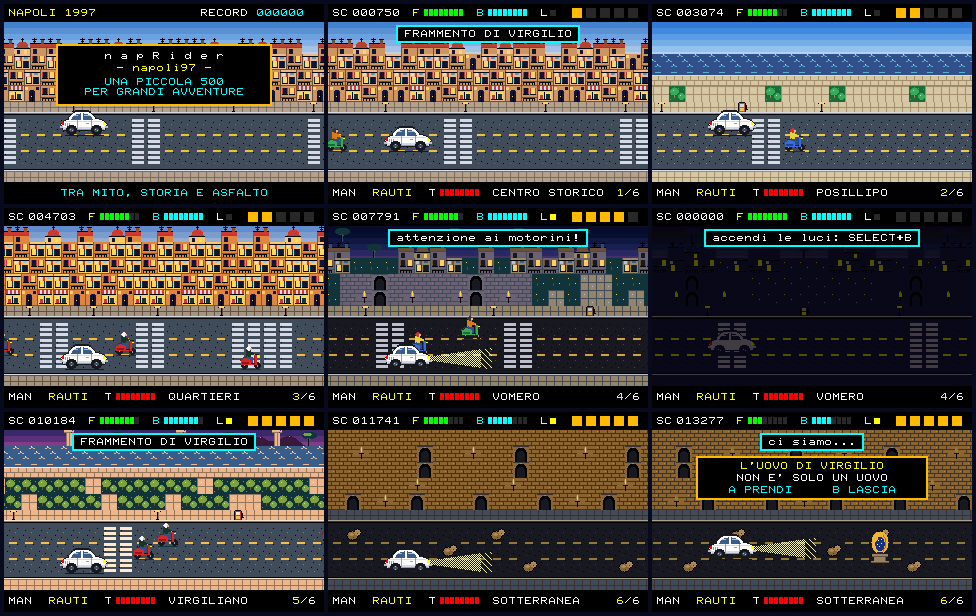

# napRider-napoli97

**napRider-napoli97** is an unofficial PRG32 horizontal-parallax arcade adventure set in Naples in 1997. The joke in the title is intentional: `nap` is Napoli, and the project playfully echoes the talking-car action genre without using official Knight Rider names, characters, logos, dialogue, music, or artwork.



A 30-second capture of the cartridge running in PRG32's QEMU firmware, with its real audio, is in [release-artifacts/naprider-napoli97-qemu-demo.mp4](release-artifacts/naprider-napoli97-qemu-demo.mp4).

## Premise

The player collects five fictional **Virgilian mosaic fragments** hidden on the roads of five districts while scooter gangs block and chase the car. Completing the mosaic opens **Napoli Sotterranea**. The final scene reaches the legendary **Egg of Virgil**, where the player can take it or leave it in place.

The story deliberately mixes real places and a historical legend with fictional game events; it is not a claim about the actual archaeology of Naples.

## The car

The hero vehicle is a **white 1971 Fiat 500 L**, drawn pixel by pixel in side view: the domed cabin over the rounded body, folded canvas roof, rear engine louvres, chrome bumpers and small wheels.

The car talks. Its four phrases from the saga are all here, each with a two-note voice:

- `vai cuonc cuonc` — start
- `ho sete` — low fuel
- `hai lasciato le luci accese` — headlights draining the battery
- `ah il freno a mano` — accelerating with the handbrake on

## How to play

| Input | Manual | Self-drive |
| --- | --- | --- |
| UP / DOWN | change lane | — |
| RIGHT / LEFT | accelerate / brake | next / previous gadget |
| A | turbo | use the gadget |
| B | switch to self-drive | switch to manual |
| SELECT | handbrake on/off | handbrake on/off |
| SELECT + B | headlights on/off | headlights on/off |

- Each district is nine screens long. Its **fragment** shows up on the road every other screen; drive over it. Leaving a district without it sends you round again.
- **Scooter gangs** grow district by district: some dawdle in your lane, some come up from behind and cut in. A collision costs fuel and speed and shakes the screen.
- **Self-drive** keeps to the top lane, dodges on its own and frees you to use the gadgets: **rauti** (fired ahead), **grasso** and **chiodi** (dropped behind). It never fetches a fragment for you.
- **Fuel** runs out in under two minutes of cruising. Petrol pumps stand on the pavement in Posillipo, Vomero and Parco Virgiliano: pass them in the top lane. An empty tank ends the run.
- **Vomero** at night and **Napoli Sotterranea** are dark without headlights. Lights drain the battery; driving unlit recharges it.
- Rubble blocks lanes underground.
- The score is kept in the firmware's local top five and synchronised with the Cartridge Store when the console is online.

## Graphics: indexed colours, exact on the board

On the ESP32-C6, PRG32 keeps the 320x200 playfield as an 8-bit indexed framebuffer with a 256-entry palette. When a cartridge draws an indexed sprite, the firmware maps each of the sprite's colours to a cell of its 6x6x6 system colour cube, so by default the art is quantised to 216 fixed colours. QEMU keeps an RGB565 surface instead and shows the sprite's own colours.

napRider uses the palette API to get the same, exact colours on both:

- the art keeps **at most one colour per cube cell** among everything visible together (`tools/generate_assets.py` enforces it, `tests/source_checks.py` re-checks it);
- the cartridge writes each colour into the palette entry of its own cell with `prg32_palette_set`, so the firmware's mapping lands on the authored colour;
- sky gradients, HUD bars and gadgets are drawn with `prg32_gfx_rect_indexed` on palette entries the cube never uses (232-243) and on the eight named colours.

`tests/harness/run_harness.c` models both display back ends and fails if a single pixel differs between them in normal play.

Everything is 4 bpp or less: a 26-tile bank shared by all districts (the pixels are *roles* such as asphalt, wall or water; each district supplies a 16-colour palette), six 20x10 maps, the car, three palette-swapped scooter gangs, the Egg, Vesuvius, an island and the headlight beam. That is about 9 KiB of art.

### Special effects

All are palette effects, so they cost no extra drawing:

- districts **fade** in from and out to black;
- the **unlit tunnel**: without headlights the whole palette drops to a third of its brightness;
- a **white flash** when a fragment is collected;
- the **sea shimmers** off Posillipo and the Parco Virgiliano; **torches** flicker underground; the **Egg** glows;
- **sky gradients** change with the hour, from afternoon in the Centro Storico to sunset at the Parco Virgiliano.

There are also three parallax layers (far, district, road), a headlight beam, turbo exhaust flame, screen shake and blinking after a crash.

## Audio: SID-like and stereo

`audio.json` is generated by `tools/generate_audio.py` and contains no PCM: ten procedural instruments (pulse, saw, triangle and noise oscillators with filter and ADSR) and eight original tracker tracks, one per district plus the Egg and a game-over sting. Music uses voices 0-3, panned left, right and centre. The game plays its effects on voices 4-7 and pans them by screen position: the engine note follows the speed, the nearest scooter buzzes from its side, and there are turbo, gadget, crash, fragment and petrol sounds. On mono hardware the pans are ignored.

The soundtrack does **not** reproduce the Knight Rider theme or any traditional melody.

## PRG32 firmware target

This repository targets **`riscv-prg32/PRG32` branch `main`** and its portable ABI-table cartridges. One build serves both Store architecture variants:

- `esp32c6` — the physical board;
- `qemu` — the ESP32-C3 QEMU graphics target.

The Store cartridge is about 36 KiB, inside the default 64 KiB package limit, and needs about 24 KiB of cartridge RAM, so it runs on every PRG32 profile including the 32 KiB classroom one. It needs ABI 1.5 or later (indexed framebuffer calls).

## Build

Requirements: a checkout of `https://github.com/riscv-prg32/PRG32` on `main`, the ESP-IDF RISC-V toolchain, Python 3 with Pillow and NumPy (`pip install -r requirements-dev.txt`).

```bash
PRG32_ROOT=/path/to/PRG32 CARTRIDGE_STORE_ROOT=/path/to/CartridgeStore ./build.sh
```

`build.sh` regenerates the art and the score, runs every test, builds the portable cartridge, attaches the Store metadata for both architectures, packs the bundle and, when a Cartridge Store checkout is available, validates the bundle with the Store's own intake code. Products:

```text
dist/store/naprider-napoli97-esp32c6.prg32
dist/store/naprider-napoli97-qemu.prg32
dist/store/manifest.json, icon.png, screenshot.png
dist/naprider-napoli97-2.0.0-store.zip
dist/SHA256SUMS
```

`dist/` is committed so the Store bundle can be taken straight from the repository.

## Run

Hardware:

```bash
python3 -m prg32 esp32c6 upload dist/store/naprider-napoli97-esp32c6.prg32 --url http://192.168.4.1
```

QEMU, from the PRG32 checkout:

```bash
python3 -m prg32 qemu upload /path/to/napRider-napoli97/dist/store/naprider-napoli97-qemu.prg32
python3 -m prg32 qemu run
```

## Validation

```bash
make check
```

runs, without ESP-IDF:

- `tests/source_checks.py` — entry points, phrases, map and palette invariants, audio layout, metadata;
- `tests/host_syntax.sh` — strict C99 `-Wall -Wextra -Werror -pedantic`;
- `tests/run_harness.sh` — a bot plays the whole campaign on a software model of both display back ends, then the controls and the failure paths are exercised.

`make screens` renders the screenshots from the harness. `make capture` runs the cartridge in the QEMU firmware, records a demo with its real audio and refreshes the Store screenshot (see `tools/qemu_capture.py`).

Version 2.0.0 was run in QEMU on PRG32 `main` at commit `a8669e5`. It has not yet been run on an ESP32-C6 board: see [RELEASE_CHECKLIST.md](RELEASE_CHECKLIST.md).

## License

Code and project-generated assets are released under the MIT License. See [NOTICE.md](NOTICE.md) for the unofficial-tribute and third-party-name statement.
