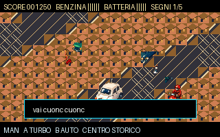

# napRider-napoli97

**napRider-napoli97** is an unofficial PRG32 isometric arcade adventure set in Naples in 1997. The joke in the title is intentional: `nap` is Napoli, and the project playfully echoes the talking-car action genre without using official Knight Rider names, characters, logos, dialogue, music, or artwork.



## Premise

The San Gennaro treasure plot has been removed. The new story is mythological: the player follows a chain of fictional **Virgilian signs** across Naples, pursued and obstructed by scooter gangs, until the route descends into **Napoli Sotterranea**. The final playable scene reaches the legendary **Egg of Virgil**, where the player can take it or leave it in place.

The story deliberately mixes real places and a historical legend with fictional game events; it is not a claim about the actual archaeology of Naples.

## Player car

The hero vehicle is a **white 1971 Fiat 500 L classic**, drawn from the approved visual sheet and packed as dedicated 8-bit indexed pseudo-3D frames. It is intentionally larger and more detailed than ordinary traffic so the 500's rounded roof, compact two-box silhouette, small wheels, chrome bumpers and rear-engine proportions remain recognizable at 320x200.

The car keeps the four signature phrases requested for the saga:

- `vai cuonc cuonc` — start
- `ho sete` — low fuel
- `hai lasciato le luci accese` — lights/battery warning
- `ah il freno a mano` — handbrake warning

## Gameplay

The game uses the isometric scrolling direction established in the visual sheet. Surface stages are Centro Storico, Posillipo, Quartieri Spagnoli, Vomero and Parco Virgiliano; the sixth and final stage is Napoli Sotterranea.

Manual drive gives direct steering, acceleration/braking, turbo and handbrake slides. `B` toggles self-drive. In AUTO the car steers toward the route while the player selects and deploys the arcade gadgets **rauti**, **grasso** and **chiodi** against pursuing scooter gangs. These are intentionally abstract game mechanics, not real-world instructions.

## 8-bit graphics and tile strategy

The approved visual sheet is included at `assets/source/naprider_visual_sheet.png` and is the actual source of the shipped graphics. `tools/extract_visual_sheet.py` derives:

- a shared 128-entry RGB565 palette;
- **66 reusable 16x16, 8-bpp indexed semantic tiles**;
- six 20x10 stage tilemaps;
- eight 48x40 pseudo-3D Fiat 500 L frames;
- eight 24x32 scooter frames;
- an indexed Virgil's Egg sprite;
- Store icon and artwork.

The runtime uses `prg32_indexed_sprite_t` with `bits_per_pixel = 8` and `prg32_sprite_draw_indexed()`. Each byte-coded map distinguishes roads, crossings, buildings, sea, seawalls, parks, plazas and underground masonry, with district-specific tiles. Current indexed graphics payload is about **42 KiB before code/audio**, leaving room inside the 128 KiB cartridge package and optional 128 KiB ESP32-C6 cartridge-RAM profile.

A deterministic contact sheet reconstructed from the actual tile bank is available at `assets/generated/runtime_stages_contact.png`.

## PRG32 firmware target

This repository targets **`riscv-prg32/PRG32` branch `main`**, not `development-c6`.

PRG32 `main` requires portable ABI-table cartridges. The package is built with `--portable` and is designed for both Store architecture variants:

- `esp32c6` — physical ESP32-C6;
- `qemu` — ESP32-C3 QEMU graphics target.

For the physical board, this game recommends the optional **128 KiB cartridge-RAM profile**, because its high-detail indexed assets intentionally use the larger cartridge budget. The game viewport remains 320x200 under that profile.

## Build

Requirements:

1. A checkout of `https://github.com/riscv-prg32/PRG32` on `main`.
2. ESP-IDF 5.4.1 environment, as used by PRG32 CI.
3. This repository anywhere on disk.

```bash
export PRG32_ROOT=/path/to/PRG32
. "$IDF_PATH/export.sh"
./build.sh
```

Expected products:

```text
dist/store/naprider-napoli97-esp32c6.prg32
dist/store/naprider-napoli97-qemu.prg32
dist/naprider-napoli97-1.0.0-store.zip
dist/SHA256SUMS
```

The build script rejects Store cartridges larger than 131072 bytes. Its portable
builder uses the 64 KiB QEMU cartridge-RAM limit; PRG32 currently defaults to
a 32 KiB build-time check even when firmware is configured for more RAM, so
`tools/build_extended.py` applies the QEMU limit during cartridge creation.
Use QEMU's extended RAM profile or the 128 KiB ESP32-C6 profile to run it.

### 128 KiB ESP32-C6 firmware profile

From the PRG32 `main` checkout:

```bash
idf.py -B build-esp32c6-128k \
  -D SDKCONFIG_DEFAULTS="sdkconfig.defaults;sdkconfig.defaults.esp32c6_128k" \
  set-target esp32c6
idf.py -B build-esp32c6-128k build
```

Check the board setup resource screen for `CART RAM` before deploying this cartridge.

## Upload / QEMU

Hardware:

```bash
python3 -m prg32 esp32c6 upload \
  dist/store/naprider-napoli97-esp32c6.prg32 \
  --url http://192.168.4.1
```

QEMU staging from the PRG32 repository:

```bash
python3 /path/to/napRider-napoli97/tools/upload_qemu_extended.py /path/to/napRider-napoli97/dist/store/naprider-napoli97-qemu.prg32
python3 -m qemu run
```

## Validation

Fast local checks do not require ESP-IDF:

```bash
make check
```

This runs the project source assertions plus a strict C11 `-Wall -Wextra -Werror` host syntax check against the small test stub. The real PRG32 headers remain authoritative; the stub is never packed into the cartridge.

Regenerate bitmap-derived assets with:

```bash
python3 -m pip install -r requirements-dev.txt
make assets
```

## Audio

`audio.json` uses PRG32 SID-like procedural instruments and stereo panning. The soundtrack is original and does **not** reproduce the Knight Rider theme melody or recording.

## Status

The repository is structured for PRG32 `main`, GitHub Actions, Cartridge Store metadata, reproducible graphics extraction, and Store bundle generation. This package was host-validated in the creation environment, but the final `.prg32` binaries must be produced by PRG32's ESP-IDF/RISC-V build environment and should be captured/tested in QEMU and on the 128 KiB-profile ESP32-C6 before tagging a public binary release.

## License

Code and project-generated assets are released under the MIT License. See [NOTICE.md](NOTICE.md) for the unofficial-tribute and third-party-name statement.
